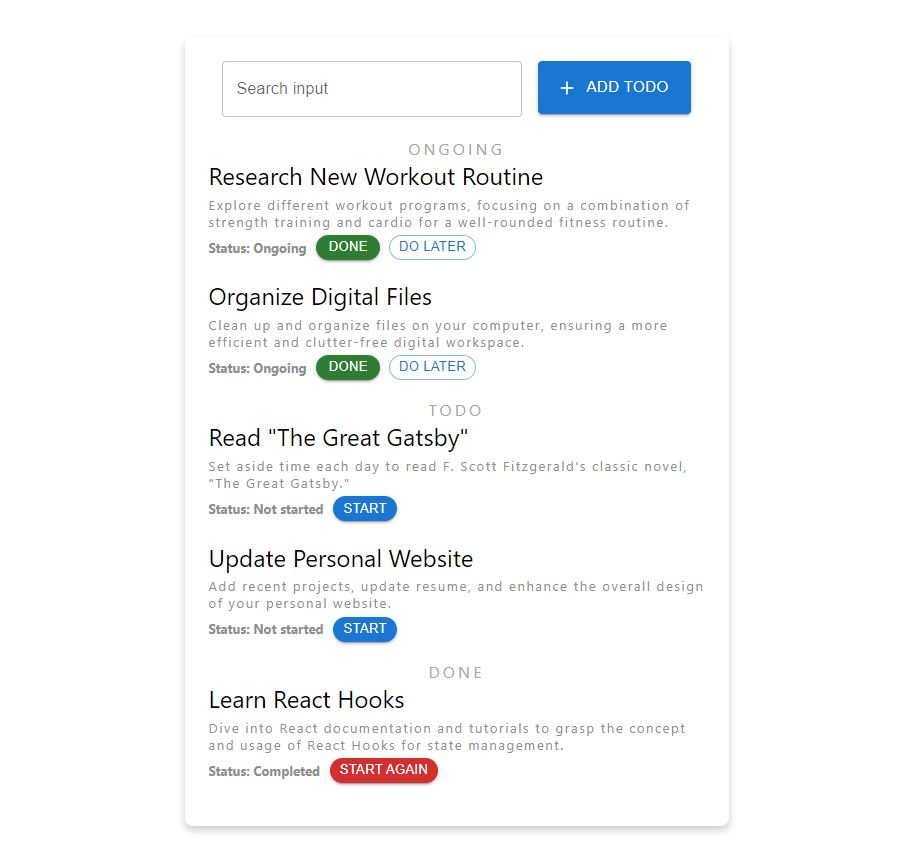
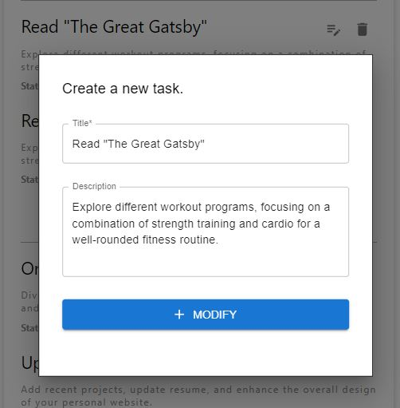

<p align="center">
  <a href="http://todo-app-99.infinityfreeapp.com/">
    
  </a>

  <h1 align="center">Todo App</h1>

  <p align="center">
    A user-friendly todo app built with Love for Pesto Assignment<3.
    <br />
    <a href="http://todo-app-99.infinityfreeapp.com">View Demo</a>
    ·
    <a href="https://github.com/akash-dutta-dev/todo-app/issues">Report Bug</a>
    ·
    <a href="https://github.com/akash-dutta-dev/todo-app/issues">Request Feature</a>
  </p>
</p>
<br><br>
#Note - The demo link might not work. Please clone the repo and follow the instructions.
 <br>     
      
<!-- TABLE OF CONTENTS -->
# Table of content
<details open="open">
  <summary>List</summary>
  <ol>
    <li>
      <a href="#about-the-project">About The Project</a>
      <ul>
        <li><a href="#todo-app">Todo App</a></li>
        <li><a href="#our-aim">Our Aim</a></li>
        <li><a href="#built-with">Built With</a></li>
      </ul>
    </li>
    <li>
      <a href="#getting-started">Getting Started</a>
      <ul>
        <li><a href="#prerequisites">Demo</a></li>
        <li><a href="#installation">Installation</a></li>
      </ul>
    </li>
    <li><a href="#features">Features</a></li>
    <li><a href="#contributing">Contributing</a></li>
    <li><a href="#license">License</a></li>
    <li><a href="#contact">Contact</a></li>
  </ol>
</details>

<!-- ABOUT THE PROJECT -->
# About The Project

## Todo App

Todo App is a User-friendly Task Management Application built with Love for Pesto Tech Assignment. [Click to open](http://todo-app-99.infinityfreeapp.com)
<br><br>


## Our Aim

Our aim is to make task management as easy as possible. By providing new features regularly that enhance user experience simultaneously keeping the application lightweight for a smooth experience. There are lots of task management applications out there with many features but multiple features sometimes clutter the workspace, causing unproductivity, so our first priority is to keep the app lightweight and minimal to human eye. Meanwhile keeping this entire thing free and open source forever.

## Built With
### FrontEnd
- React
- Material UI
- Javascript
- SCSS/CSS
- HTML

### Backend 
- NodeJs
- ExpressJs
- Sequelize (ORM)
- Sessions 

### Database
- MySQL

<!-- Getting Started -->
# Getting Started
## Demo
To view the working demo -
Visit - http://todo-app-99.infinityfreeapp.com
<br><br>
Test Credentials -
<br>
Username - abc@gmail.com  Password - abc@123
<br>
Username - test@gmail.com Password - password

## Installation
- Install and run Mysql Server and create a database ```todo```
- Clone the code and configure the ```backend/config/config.json``` to connect your mysql server.
- Then execute the following commands.
```
// For backend, 
cd backend
npm install
node index.js

// For frontend 
cd frontend
npm install
npm run dev
```
- The project will start running at ```http://localhost:5173/```
- Enjoy.
<br>

Let me know if you face any errors or issues.

## Features
### For assignment - Frontend
- User-friendly interface for the task management application
- Form to create a new task with fields for title, description, and status.
- Ability to update the status to ongoing/todo/done
- Ability to delete a task.
- Ability to edit a task.
- A radio button to filter tasks by status (showa all/ongoing/todo/done)
- Responsive user interactions
- Form validation
- Styling the application using CSS and Material UI

### For assignment - Backend
- RESTful API created to handle the CRUD operations for tasks
- Implemented a database to store task data.
- Implemented data models to represent tasks and users using Sequelizer ORM
- Implemented server-side validation to save forms before entering into the database.
- Implemented correct status code for success and errors specific codes (200/201/400/401/500)
- Error handling while reading or writing to database.

### Additional features
- User login form with email and password validation.
- User state management using sessions.
- Task sorting and searching capacities.

### Future Scope
- Team collaboration like admin can create a project  and add members
- Admin can give create, read, and write access.
- Profile page.
- Reminder

<!-- CONTRIBUTING -->
# Contributing

Contributions are what make the open-source community such an amazing place to learn, inspire, and create. Any contributions you make are **greatly appreciated**.

1. Fork the Project
2. Create your Feature Branch (`git checkout -b feature/AmazingFeature`)
3. Commit your Changes (`git commit -m 'Add some AmazingFeature'`)
4. Push to the Branch (`git push origin feature/AmazingFeature`)
5. Open a Pull Request


<!-- LICENSE -->
# License

Distributed under the MIT License. See `LICENSE` for more information.

<!-- CONTACT -->
# Contact

Email - akash.dutta9830489799@gmail.com

LinkedIn - https://www.linkedin.com/in/akash-dutta/ 

Instgram - https://www.instagram.com/akash_dutta97
